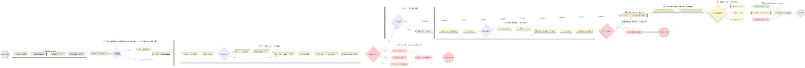
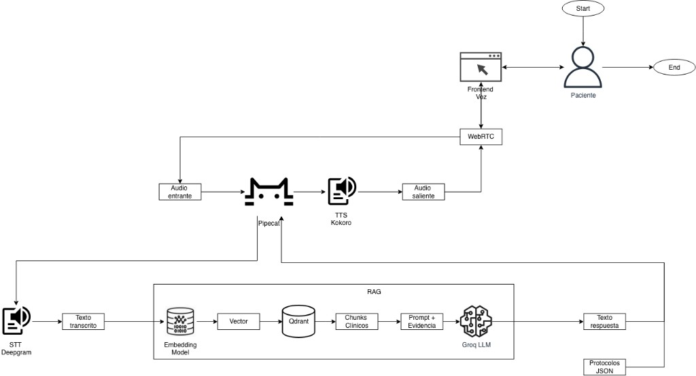
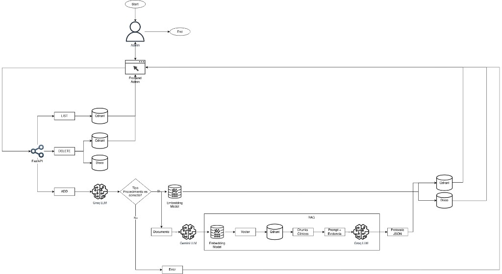

# Arquitectura del agente postoperatorio

Documentación de ingeniería de datos sobre cómo está construido el sistema, cómo fluye la
información clínica y por qué cada pieza tecnológica ocupa el lugar que ocupa.

**Diagramas incluidos en esta carpeta:**

| Archivo | Contenido |
|---------|-----------|
| [`flujo-decision-agente.png`](flujo-decision-agente.png) | Pipeline de decisión por turno de conversación |
| [`flujo-paciente-agente.png`](flujo-paciente-agente.png) | Arquitectura de la llamada de voz paciente ↔ agente |
| [`flujo-admin.png`](flujo-admin.png) | Arquitectura de administración e ingestión de conocimiento |

---

## Visión general

El sistema resuelve dos problemas distintos con un mismo corpus clínico:

1. **Llamada de voz en tiempo real** — Un paciente habla con el agente; el agente
   conversa, consulta evidencia y decide si escalar.
2. **Gestión del conocimiento clínico** — Un administrador sube o actualiza documentos;
   el sistema los indexa, valida el procedimiento y **genera un protocolo JSON** por
   carpeta de procedimiento.

La pieza que une ambos mundos es el **protocolo JSON** (`protocol.json`): no es la
respuesta que oye el paciente, sino la **regla de negocio estructurada** que define qué
preguntar, cómo puntuar síntomas y cuándo disparar una alerta. El LLM conversa en
lenguaje natural; Python aplica el protocolo de forma **determinística y auditable**.

```
Corpus clínico (PDFs)  →  [Admin] indexación + RAG  →  protocol.json por procedimiento
                                                              ↓
Paciente (voz)  →  [Agente] STT + Groq + RAG  →  extracción de síntomas  →  scoring (protocol.json)
                                                              ↓
                                         respuesta hablada + resumen clínico + alerta
```

---

## El protocolo JSON por procedimiento

### Qué es y por qué existe

Cada procedimiento postoperatorio (p. ej. `appendicitis`, `cataract-surgery`) tiene un
archivo `storage/protocols/{procedure_id}/protocol.json`. Ese archivo es el **contrato
de datos** entre el conocimiento clínico indexado y la lógica de triaje del agente.

Separar conversación (LLM) de decisión (código + JSON) cumple tres objetivos de
ingeniería de datos:

- **Trazabilidad:** cada síntoma incluye `fuentes` con IDs de chunks RAG usados al
  generar el protocolo.
- **Reproducibilidad:** dos ejecuciones con los mismos valores de síntoma producen el
  mismo score y severidad.
- **Hot-reload:** al reindexar un procedimiento se regenera el JSON; la próxima llamada
  usa la versión vigente sin redeploy del agente.

Si no existe protocolo específico, o el procedimiento es **“Otro”**, se usa el protocolo
general en `storage/protocols/general/protocol.json`.

### Estructura del JSON

El esquema está definido en `src/knowledge/protocol/models.py` (`PostOpProtocol`). Un
ejemplo real (recortado) de `bootstrap/protocols/appendicitis/protocol.json`:

```json
{
  "procedure": "appendicitis",
  "version": "1.0",
  "generated_at": "2026-08-12T02:02:07.767665Z",
  "source_ids": ["src_21ce22f530b67553", "..."],
  "symptoms": [
    {
      "id": "fiebre",
      "question": "¿Ha tenido fiebre? ¿Cuál ha sido su temperatura...?",
      "type": "numeric",
      "levels": [
        { "min": 0.0, "max": 37.4, "points": 0, "label": "verde" },
        { "min": 37.5, "max": 38.0, "points": 4, "label": "amarillo" },
        { "min": 38.1, "max": 42.0, "points": 10, "label": "rojo" }
      ],
      "fuentes": ["src_547eb29ec3e9853d", "..."]
    }
  ],
  "thresholds": {
    "green_max": 4,
    "yellow_max": 14,
    "alert_min": 15
  },
  "alert_signs": ["..."],
  "risk_factors": [...]
}
```

| Campo | Rol en runtime |
|-------|----------------|
| `symptoms[]` | Preguntas de triaje, tipos (`numeric`, `boolean`, …) y rangos con puntos por banda |
| `thresholds` | Umbrales acumulados para severidad verde / amarillo / rojo y alerta |
| `alert_signs` | Señales de alarma que fuerzan escalamiento aunque el score sea bajo |
| `risk_factors` | Comorbilidades del paciente que suman puntos extra al score |
| `source_ids` / `fuentes` | Trazabilidad hacia chunks del corpus en Qdrant |

### Ciclo de vida del protocolo

```mermaid
flowchart LR
  A[PDFs en data/textos/{procedure}/] --> B[Ingest + chunking + embeddings]
  B --> C[(Qdrant)]
  B --> D[Disco: storage/documents/]
  C --> E[RAG ampliado para protocolo]
  E --> F[Gemini: generación JSON]
  F --> G[protocol.json en storage/protocols/]
  G --> H[Carga en start_call]
  H --> I[Scoring determinístico por turno]
```

**Generación (batch, vía admin):**

1. `reindex_procedure()` procesa **toda la carpeta** del procedimiento (`src/knowledge/ingest/pipeline.py`).
2. `generate_protocol_for_procedure()` recupera fragmentos clínicos con RAG dedicado
   (`protocol_retrieval_top_k`, umbrales más permisivos que el RAG conversacional).
3. **Gemini** (`ProtocolGeminiClient`) produce el JSON a partir de la evidencia.
4. Si hay pocos síntomas, se reintenta con retrieval expandido; si sigue siendo escaso,
   se hace merge con el protocolo general (`merge_with_general_fallback`).
5. El resultado se persiste en `storage/protocols/{procedure_id}/protocol.json`.

**Carga en la llamada:**

En `PostOpOrchestrator.start_call()`, `attach_protocol_to_session()` lee el JSON y lo
desnormaliza en la sesión (`protocol_symptoms`, `protocol_thresholds`, `alert_signs`,
`risk_factors`). Así cada turno trabaja sobre una copia estable del protocolo activo.

**Uso en triaje (sin LLM):**

Tras cada turno, `_apply_turn_decision()` en el orquestador:

1. Extrae valores de síntomas del output estructurado de Groq.
2. Ejecuta `score_turn_from_protocol()` — puntúa cada síntoma según sus `levels`.
3. Aplica factor temporal `get_day_factor(postop_day)` (día 1 pesa menos que día 7).
4. Acumula score con `apply_cumulative_score()` usando `thresholds`.
5. Evalúa `detect_critical_alert()` contra `alert_signs`.
6. Resuelve severidad (`verde` / `amarillo` / `rojo`) y si debe forzarse alerta.

El resumen clínico al cierre (`clinical_summary.py`) reutiliza la misma lógica; no hay
un segundo LLM que “reinterprete” la severidad.

---

## Flujo de decisión del agente



El diagrama resume el pipeline **por turno** de una llamada activa. A continuación se
alinea cada etapa con el código.

### 1. Entrada: audio → texto

El frontend de voz envía audio por **WebRTC**. **Pipecat** orquesta el pipeline;
**Deepgram** transcribe a texto en español. La latencia STT es la primera componente del
presupuesto de tiempo real (ver [`docs/metrics/README.md`](../metrics/README.md)).

### 2. Contexto de sesión + protocolo

Al iniciar la llamada ya está cargado el `protocol.json` del procedimiento. La sesión
guarda día postoperatorio, comorbilidades, síntomas ya cubiertos y score acumulado.

### 3. Retrieval (RAG conversacional)

Para cada mensaje del paciente, `ContextualRetriever` embeddea la consulta con
**IBM Granite** (`granite-embedding-97m-multilingual-r2`) y busca en **Qdrant** chunks
filtrados por `procedure_id`. El umbral (`retrieval_score_threshold`, default 0.70)
evita inyectar evidencia débil.

Si no hay evidencia suficiente para el procedimiento, el agente responde con honestidad
limitada — no inventa guías clínicas.

### 4. Inferencia conversacional (Groq)

**Groq** (`llama-3.3-70b-versatile`) recibe:

- Historial reciente de la conversación.
- Fragmentos RAG recuperados.
- Instrucciones para hablar en tono empático y breve (voz).
- El síntoma focal del protocolo pendiente de cubrir.

El LLM devuelve un output estructurado (`LLMTurnOutput`): texto para el paciente,
categoría de la respuesta, valores de síntomas detectados en el turno y señales
implícitas de alarma.

### 5. Decisión clínica (protocolo JSON)

Aquí ocurre la separación clave **conversación vs. decisión**:

| Responsable | Qué hace |
|-------------|----------|
| Groq | Entiende lenguaje coloquial, extrae síntomas, redacta respuesta |
| `protocol.json` + Python | Puntúa, acumula, clasifica severidad, dispara alerta |

Si el score supera `alert_min` o hay un signo crítico, se sustituye la respuesta por el
mensaje de escalamiento y se marca `alert_triggered` en la sesión.

### 6. Salida: voz + artefactos administrativos

- **Paciente:** el texto de respuesta pasa por **Kokoro TTS** y vuelve como audio por WebRTC.
- **Equipo clínico:** al cerrar la llamada se genera un `CallSummary` con severidad,
  síntomas consolidados, reglas de scoring aplicadas y fuentes RAG consultadas.
- **Observabilidad:** cada turno registra tokens, latencias RAG/LLM/TTS y métricas
  agregables vía `postop-call-metrics`.

### Bucle de triaje guiado por protocolo

El agente no pregunta síntomas al azar: recorre la lista `symptoms[]` del JSON. Cada
turno intenta cubrir el síntoma focal actual; cuando el paciente responde con claridad,
ese ID pasa a `covered_symptoms` y avanza al siguiente. El score es **acumulativo** a lo
largo de la llamada, no solo del último turno.

---

## Arquitectura paciente ↔ agente



Capas del stack de voz y su función:

| Capa | Tecnología | Función |
|------|------------|---------|
| Frontend | Next.js (`voice-ui`) | UI de llamada, señalización WebRTC |
| Transporte | WebRTC | Audio bidireccional de baja latencia |
| Orquestación | Pipecat | Pipeline STT → LLM → TTS, manejo de turnos |
| STT | Deepgram Nova-2 | Transcripción en español en streaming |
| Agente | `PostOpOrchestrator` + Groq | RAG + conversación + decisión |
| Embeddings + vector store | Granite + Qdrant | Recuperación de evidencia clínica |
| TTS | Kokoro | Síntesis de voz en español (voz `ef_dora`) |
| Protocolo | `protocol.json` | Reglas de triaje por procedimiento |

**Por qué esta combinación:**

- **Pipecat** abstrae el pipeline de voz y encaja con proveedores intercambiables; evita
  acoplar la lógica clínica al transporte WebRTC.
- **Deepgram** ofrece STT streaming con buena latencia para español clínico coloquial.
- **Groq** acelera inferencia del LLM conversacional — crítico cuando el paciente espera
  respuesta en menos de unos segundos.
- **Kokoro** corre local/contenedor: TTS sin costo por carácter y control del TTFB en
  despliegues Docker de evaluación.
- **Qdrant + Granite** separan almacenamiento vectorial del modelo de embedding; el
  modelo multilingüe compacto (384 dims) equilibra calidad RAG y velocidad de búsqueda.

Flujo de datos simplificado:

```
Paciente → WebRTC → Pipecat → Deepgram → texto
                → PostOpOrchestrator → Granite embed → Qdrant → chunks
                → Groq → LLMTurnOutput
                → scoring(protocol.json) → texto respuesta
                → Kokoro → audio → WebRTC → Paciente
```

---

## Arquitectura de administración



El panel admin (`admin-ui` vía nginx) habla con la **API FastAPI** (`src/api/`). Las
operaciones principales son listar, subir y eliminar documentos por procedimiento.

### Ramas CRUD

| Operación | Qué ocurre |
|-----------|------------|
| **LIST** | Consulta metadatos de documentos indexados (Qdrant + disco) |
| **DELETE** | Elimina vectores en Qdrant y archivos en `storage/documents/` |
| **ADD** | Valida procedimiento → ingest → reindex carpeta → regenera `protocol.json` |

### Flujo ADD (el más relevante para datos)

1. **Upload** del PDF a `data/textos/{procedure_id}/`.
2. **Validación de procedimiento** con **Gemini**: si el tipo de procedimiento no cuadra
   con el documento, la API devuelve error al frontend (evita contaminar el índice).
3. **Ingest:** extracción de texto, chunking (512 tokens, overlap 64), embeddings Granite,
   upsert en Qdrant con metadatos (`procedure_id`, hash, `source_id`).
4. **Reindex de carpeta completa:** `reindex_procedure()` garantiza coherencia cuando hay
   varios PDFs por procedimiento; omite PDFs sin cambios de hash.
5. **Generación de protocolo:** RAG ampliado + Gemini → nuevo `protocol.json`.
6. **Hot-reload:** el runtime de voz/API recarga retriever y protocolos sin reiniciar
   contenedores (`shared_runtime`, tests en `tests/test_hot_reload.py`).

**Por qué Gemini en admin y Groq en voz:**

| Contexto | Modelo | Razón |
|----------|--------|-------|
| Conversación en vivo | Groq | Throughput y latencia para turnos sub-segundo |
| Generación de protocolo JSON | Gemini | Ventana amplia, salida JSON estructurada, tarea batch |
| Validación de documento al upload | Gemini | Clasificación con excerpt del PDF, no time-critical |

Admin no compite por cuota con las llamadas activas; además la generación de protocolo
puede tardar decenas de segundos (`protocol_generation_delay_seconds`) sin afectar al
paciente.

---

## Stack tecnológico — resumen y criterios de selección

| Dominio | Tecnología | Por qué |
|---------|------------|---------|
| API / admin | FastAPI, Pydantic | Tipado, validación de esquemas, OpenAPI para el panel |
| Frontend voz | Next.js | UI WebRTC moderna, despliegue estático |
| Frontend admin | nginx + SPA | Servir panel admin separado del pipeline de voz |
| Orquestación voz | Pipecat | Pipeline declarativo STT/LLM/TTS |
| STT | Deepgram | Streaming, español, integración Pipecat |
| TTS | Kokoro | Local, predecible en Docker, sin API externa en evaluación |
| LLM tiempo real | Groq + Llama 3.3 70B | Velocidad de inferencia para conversación |
| LLM batch | Gemini Flash | Protocolos JSON y validación de ingest |
| Embeddings | IBM Granite 97M multilingüe | Español clínico, 384 dims, eficiente en CPU/GPU modesta |
| Vector DB | Qdrant | Filtros por metadata, hot-reload, despliegue en Docker |
| Persistencia | Disco (`storage/`) | PDFs, protocolos JSON, trazas de llamada |
| Contenedores | Docker Compose | Entorno reproducible para evaluación G2 |
| Config | Pydantic Settings | Una fuente de verdad (`src/core/config.py`, `.env`) |

Principio transversal: **el LLM interpreta lenguaje; el protocolo JSON y Python deciden
clínica.** Eso reduce alucinaciones en escalamiento, facilita auditoría y permite
evolucionar el corpus sin reentrenar modelos.

---

## Referencias en el código

| Tema | Ubicación |
|------|-----------|
| Modelo del protocolo JSON | `src/knowledge/protocol/models.py` |
| Generación batch del protocolo | `src/knowledge/protocol/generator.py` |
| Carga en sesión | `src/knowledge/protocol/loader.py`, `src/agent/decision/session_protocol.py` |
| Scoring y severidad | `src/agent/decision/scoring.py` |
| Resumen clínico | `src/agent/decision/clinical_summary.py` |
| Orquestador (turnos + decisión) | `src/agent/orchestrator.py` |
| RAG conversacional | `src/knowledge/retrieval/` |
| Ingest + reindex | `src/knowledge/ingest/pipeline.py` |
| API admin | `src/api/main.py`, `src/api/services/documents.py` |
| Pipeline de voz | `src/voice/` |
| Configuración | `src/core/config.py` |
| Protocolos de ejemplo | `bootstrap/protocols/` |
| Métricas operativas | [`docs/metrics/README.md`](../metrics/README.md) |

---

## Lecturas relacionadas

- [Métricas operativas (latencia, tokens, costos)](../metrics/README.md)
- [Stack técnico del reto](../stack-tecnico.md)
- [Guía Docker](../docker-guia.md)
