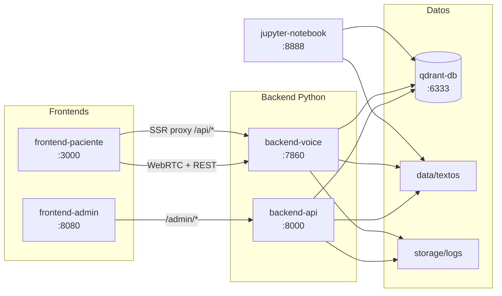

# Guía Docker — flujo completo de punta a punta

Esta guía te lleva **desde cero** hasta tener **todas las aplicaciones funcionando en Docker**:
consola admin, app de voz del paciente, APIs backend, Qdrant y (opcional) Jupyter.

Está pensada para quien **clona el repo por primera vez** y quiere replicar el sistema sin
saltarse ningún paso.

---

## Qué vas a tener al final

Cuando completes todos los pasos, deberías poder:

- [ ] Abrir la **app paciente** en http://localhost:3000, registrar un paciente e iniciar una **llamada de voz real**.
- [ ] Abrir la **consola admin** en http://localhost:8080, autenticarte, listar documentos y **subir un PDF**.
- [ ] Ver en admin la **lista de llamadas** y el resumen clínico después de una llamada de prueba.
- [ ] Confirmar que Qdrant tiene documentos indexados y que existen **protocolos JSON** por procedimiento.
- [ ] (Opcional) Abrir **Jupyter Lab** en http://localhost:8888 para explorar los datos.

---

## Mapa del sistema



| Servicio | URL en tu máquina | Qué hace |
| -------- | ----------------- | -------- |
| `frontend-paciente` | http://localhost:3000 | Registro del paciente + llamada de voz (María) |
| `frontend-admin` | http://localhost:8080 | Consola para subir PDFs y ver llamadas |
| `backend-api` | http://localhost:8000 | API FastAPI (admin, ingest, trazas) |
| `backend-voice` | http://localhost:7860 | Pipecat + Groq + Deepgram + Kokoro (WebRTC) |
| `qdrant-db` | http://localhost:6333 | Base vectorial (embeddings IBM Granite) |
| `jupyter-notebook` | http://localhost:8888 | EDA sobre PDFs y datasets (perfil opcional) |

> La consola admin es una SPA estática (`apps/admin-ui/`). Nginx la sirve en el puerto 8080 y
> reenvía las peticiones `/admin/*` al backend FastAPI.

---

## Paso 0 — Requisitos previos

Antes de empezar, verifica lo siguiente en tu computadora.

### Software

| Requisito | Versión mínima | Cómo comprobarlo |
| --------- | -------------- | ---------------- |
| Docker Engine | 24+ | `docker --version` |
| Docker Compose | v2 | `docker compose version` |
| Git | cualquiera reciente | `git --version` |
| Navegador | Chrome o Edge recomendado | Para WebRTC y micrófono |

### Recursos

- **RAM libre:** ~8 GB (la primera build descarga modelos Kokoro + IBM Granite).
- **Disco libre en Docker Desktop:** ≥ 20 GB.
- **Micrófono:** necesario para probar la llamada de voz (el navegador pedirá permiso).

### Cuentas y API keys

Necesitas tres claves externas (todas con plan gratuito o trial):

| Variable en `.env` | Servicio | Para qué se usa |
| ------------------ | -------- | --------------- |
| `GROQ_API_KEY` | [Groq](https://console.groq.com/) | Conversación del agente en tiempo real |
| `GEMINI_API_KEY` | [Google AI Studio](https://aistudio.google.com/apikey) | Validación de PDFs en admin + generación de protocolos |
| `DEEPGRAM_API_KEY` | [Deepgram](https://console.deepgram.com/) | Speech-to-Text (transcripción de voz) |

> Sin estas tres claves la app arranca, pero **no podrás hacer llamadas de voz** ni **subir PDFs nuevos** desde admin.

---

## Paso 1 — Clonar el repositorio

Abre una terminal y clona el proyecto (o entra al directorio si ya lo tienes):

```bash
git clone <URL_DEL_REPO> postop-voice-agent
cd postop-voice-agent
```

Comprueba que existen los datos clínicos y los artefactos bootstrap:

```bash
# Debe listar carpetas con PDFs (appendicitis, cholecystitis, etc.)
ls data/textos/

# Debe listar protocol.json por procedimiento
ls bootstrap/protocols/*/protocol.json

# Debe existir un snapshot de Qdrant (arranque rápido)
ls bootstrap/qdrant/*.snapshot
```

**Resultado esperado:** al menos un `.snapshot` en `bootstrap/qdrant/` y varios `protocol.json`
en `bootstrap/protocols/`. El repo ya trae estos archivos para que el primer arranque sea rápido.

---

## Paso 2 — Crear y editar el archivo `.env`

El archivo `.env` concentra secretos y configuración local. **No se commitea a git.**

```bash
cp .env.example .env
```

Abre `.env` con tu editor y configura **como mínimo** estas variables:

```env
GROQ_API_KEY=gsk_...          # tu clave real de Groq
GEMINI_API_KEY=AI...            # tu clave real de Gemini
DEEPGRAM_API_KEY=...            # tu clave real de Deepgram
ADMIN_TOKEN=mi_token_secreto    # inventa un token largo; lo usarás en la consola admin
```

**Importante sobre `ADMIN_TOKEN`:**

- Debe ser el **mismo valor** que pegues después en http://localhost:8080.
- Si lo cambias después de guardar el token en el navegador, borra el token guardado y vuelve a autenticarte.

**No cambies** (salvo que sepas lo que haces) estas variables para Docker local:

```env
NEXT_PUBLIC_VOICE_API_URL=http://localhost:7860
QDRANT_HOST=localhost          # docker-compose lo sobreescribe a qdrant-db dentro de contenedores
```

(Opcional) Ver la configuración efectiva si tienes `uv` instalado en el host:

```bash
uv run postop-config-example --show
```

---

## Paso 3 — Levantar todo el stack (camino recomendado)

El script `docker-eval-up.sh` hace **build + up + bootstrap de datos + verificación** en un solo comando.

```bash
chmod +x scripts/docker-eval-up.sh
./scripts/docker-eval-up.sh
```

### Qué hace el script por dentro (4 fases)

| Fase | Acción |
| ---- | ------ |
| **1/4 Build** | Construye `postop-backend:local`, frontend paciente y frontend admin. **No** construye Jupyter (ahorra tiempo). |
| **2/4 Up** | Copia protocolos `bootstrap/protocols/` → `storage/protocols/` si está vacío. Levanta todos los contenedores. |
| **3/4 Bootstrap Qdrant** | Restaura el snapshot de `bootstrap/qdrant/` en Qdrant. Si no hay índice, ingesta PDFs con `--skip-protocols`. |
| **4/4 Verificación** | Comprueba que `/api/readiness` del backend de voz responde OK. |

### Cuánto tarda

| Escenario | Tiempo típico |
| --------- | ------------- |
| **Primera vez** con snapshot en el repo | ~2–10 min (según red y CPU) |
| **Primera vez** sin snapshot (ingesta fallback) | ~10–18 min |
| **Arranques posteriores** (caché Docker) | ~1–3 min |

Al terminar verás algo como:

```
Tiempo total: 1m 32s

URLs:
  Paciente:  http://localhost:3000
  Admin:     http://localhost:8080
  Voice API: http://localhost:7860/api/readiness
```

> **Primera build:** descarga PyTorch CPU, Kokoro TTS e IBM Granite (~6–10 min). Es normal.
> Las builds siguientes reutilizan caché de Docker BuildKit.

---

## Paso 4 — Verificar que todos los servicios están sanos

Ejecuta estos comandos **uno por uno**. Cada uno debe terminar sin error.

```bash
# 1. Estado de contenedores (todos "healthy" o "running")
docker compose ps

# 2. Qdrant
curl -sf http://localhost:6333/readyz && echo " → Qdrant OK"

# 3. API admin
curl -sf http://localhost:8000/openapi.json > /dev/null && echo " → Admin API OK"

# 4. Backend de voz (status básico)
curl -sf http://localhost:7860/status && echo ""

# 5. Readiness de voz (índice + protocolos listos para llamadas)
curl -sf http://localhost:7860/api/readiness | python3 -m json.tool

# 6. Frontend paciente
curl -sf http://localhost:3000 > /dev/null && echo " → Frontend paciente OK"

# 7. Frontend admin
curl -sf http://localhost:8080 > /dev/null && echo " → Frontend admin OK"
```

**Resultado esperado de `/api/readiness`:**

```json
{
  "ready": true,
  "detail": "Listo para llamadas de voz.",
  "indexed_documents": ...,
  "indexed_procedures": ["appendicitis", "..."],
  "missing_protocols": []
}
```

Si `"ready": false`, lee el campo `"detail"`: te dirá si falta ingesta, protocolos o Qdrant.
Consulta la sección [Solución de problemas](#solución-de-problemas) al final.

---

## Paso 5 — Probar la consola admin (http://localhost:8080)

### 5.1 Autenticación

1. Abre http://localhost:8080 en el navegador.
2. En el campo **Token de administrador**, pega el valor de `ADMIN_TOKEN` de tu `.env`.
3. Pulsa **Guardar token**.
4. Debe aparecer un mensaje de éxito y habilitarse la pestaña **Documentos**.

Si ves *"Token de administrador inválido"*, el token no coincide con `ADMIN_TOKEN` en `.env`.
Corrige `.env`, reinicia el backend admin y vuelve a intentar:

```bash
docker compose restart backend-api
```

### 5.2 Listar documentos indexados

1. Con el token guardado, pulsa **Actualizar** en la pestaña Documentos.
2. Deberías ver una tabla con PDFs ya indexados (procedimientos del corpus inicial).
3. El contador muestra cuántos documentos hay en Qdrant.

### 5.3 Subir un PDF nuevo

1. Pulsa **Seleccionar archivo** y elige un PDF clínico.
2. En **Tipo de procedimiento**, selecciona el procedimiento correspondiente
   (p. ej. `appendicitis`, `cholecystitis`).
3. Pulsa **Subir e indexar**.
4. Espera el toast verde de éxito (puede tardar 30 s – 2 min según tamaño del PDF).
5. Pulsa **Actualizar** y confirma que el documento aparece en la lista.

**Qué ocurre en backend al subir:**

- El PDF se guarda en `data/textos/{procedimiento}/`.
- Se valida el tipo de procedimiento con **Gemini**.
- Se reindexa **toda la carpeta** del procedimiento en Qdrant.
- Se regenera `storage/protocols/{procedimiento}/protocol.json`.

**Procedimiento "Otro":** el flujo pide confirmar el tipo sugerido por Gemini antes de indexar.

### 5.4 Ver llamadas (después de probar voz en el Paso 6)

1. Cambia a la pestaña **Llamadas**.
2. Pulsa **Actualizar**.
3. Tras una llamada de prueba, verás filas con paciente, procedimiento, día postop y decisión
   (verde / amarillo / rojo).
4. Pulsa **Ver resumen** para leer el resumen clínico completo.

---

## Paso 6 — Probar la app paciente y la llamada de voz (http://localhost:3000)

### 6.1 Registro del paciente

1. Abre http://localhost:3000.
2. Completa el formulario:

   | Campo | Ejemplo |
   | ----- | ------- |
   | Nombre | María González |
   | ID paciente | PAC-001 |
   | Día postoperatorio | Día 1 |
   | Procedimiento | Appendicitis (o cualquier procedimiento indexado) |
   | Comorbilidades | Opcional; aparecen según el protocolo del procedimiento |

3. Pulsa **Iniciar seguimiento** (o el botón equivalente del formulario).

### 6.2 Comprobar que la llamada está habilitada

En la pantalla principal del dashboard:

- Si el sistema **no está listo**, verás un recuadro amarillo con el motivo
  (p. ej. *"No hay documentos indexados"*).
- Si está listo, el botón **Iniciar llamada** estará activo (no gris).

El botón depende de `GET http://localhost:7860/api/readiness` con `"ready": true`.
Si el Paso 4 ya pasó, aquí debería estar habilitado.

### 6.3 Iniciar la llamada de voz

1. Pulsa **Iniciar llamada**.
2. El navegador pedirá **permiso de micrófono** → acepta.
3. Espera unos segundos mientras se negocia WebRTC con el backend de voz.
4. Escucharás la voz de **María** (Kokoro TTS) con la primera pregunta de triaje.
5. Responde en voz alta, como un paciente real (p. ej. *"Sí, tengo un poco de dolor, como un 3"*).
6. La transcripción y las respuestas del agente aparecen en pantalla.
7. Pulsa **Finalizar llamada** cuando quieras terminar.

### 6.4 Resumen al colgar

Tras finalizar:

- La UI muestra un **resumen de la llamada**: severidad, síntomas reportados y próximos pasos.
- Vuelve a la consola admin (Paso 5.4) y confirma que la llamada aparece en la pestaña Llamadas.

### 6.5 Ver trazas en disco

Cada llamada genera logs en el host:

```bash
ls storage/logs/calls/
# Dentro de cada UUID: eventos JSON, resumen clínico, reglas de scoring aplicadas
```

---

## Paso 7 — (Opcional) Levantar Jupyter Lab

Jupyter **no** forma parte del camino crítico de evaluación. Levántalo solo si quieres explorar datos.

```bash
docker compose --profile analysis up -d jupyter-notebook
```

Espera ~1–2 min (primera build de la imagen Jupyter) y abre:

**http://localhost:8888**

Notebook incluido: `notebooks/eda_dataset_textos.ipynb` — EDA sobre los PDFs clínicos.

Para detener Jupyter sin tumbar el resto:

```bash
docker compose --profile analysis stop jupyter-notebook
```

---

## Paso 8 — Verificar artefactos de datos

Confirma que el pipeline de datos quedó consistente:

```bash
# Protocolos JSON por procedimiento (runtime)
ls storage/protocols/*/protocol.json

# PDFs clínicos (admin y corpus inicial comparten esta carpeta)
find data/textos -name '*.pdf' | wc -l

# Puntos indexados en Qdrant
curl -sf http://localhost:6333/collections/postop_clinical_knowledge | \
  python3 -c "import json,sys; print('points:', json.load(sys.stdin)['result']['points_count'])"
```

**Valores orientativos** con el snapshot del repo: miles de points en Qdrant (> 100 mínimo)
y al menos el protocolo `general` más los procedimientos del corpus.

---

## Paso 9 — Detener, reiniciar y arrancar en frío

### Parar conservando datos (Qdrant, logs, protocolos)

```bash
docker compose down
```

### Volver a levantar (sin rebuild)

```bash
./scripts/docker-eval-up.sh
```

O manualmente:

```bash
docker compose up -d
```

### Arranque en frío (borra volumen Qdrant; útil para probar bootstrap)

```bash
docker compose down -v
./scripts/docker-eval-up.sh
```

Con el snapshot en `bootstrap/qdrant/`, Qdrant se repuebla en segundos.

### Ver logs en vivo

```bash
# Voz + frontend paciente
docker compose logs -f backend-voice frontend-paciente

# Admin API
docker compose logs -f backend-api
```

---

## Camino manual (sin `docker-eval-up.sh`)

Si prefieres ejecutar cada paso tú mismo:

```bash
# 1. Build
export DOCKER_BUILDKIT=1
docker compose build backend-api frontend-paciente frontend-admin

# 2. Seed protocolos en host (si storage/protocols/ está vacío)
mkdir -p storage/protocols
cp -a bootstrap/protocols/. storage/protocols/

# 3. Levantar
docker compose up -d

# 4. Esperar healthy y restaurar Qdrant
docker compose exec -T backend-api python scripts/restore_qdrant_bootstrap.py

# 5. Si readiness falla: ingesta fallback
docker compose --profile init run --rm ingest-init postop-ingest --recreate --skip-protocols

# 6. Verificar
curl -sf http://localhost:7860/api/readiness | python3 -m json.tool
```

### Ingesta completa con regeneración de protocolos (desarrollo)

Incluye llamadas a Gemini por procedimiento; tarda más:

```bash
docker compose --profile init run --rm ingest-init
# equivalente a: postop-ingest --recreate
```

> **Advertencia:** la ingesta **dentro de Docker** en Mac puede tardar **1–3 horas** por CPU
> limitada. Para regenerar el snapshot bootstrap, usa el script local (mucho más rápido):

```bash
chmod +x scripts/build-bootstrap.sh
./scripts/build-bootstrap.sh          # recomendado: uv en host + Qdrant en Docker
./scripts/build-bootstrap.sh --docker # solo si necesitas reproducir el contenedor exacto
```

---

## Volúmenes y carpetas persistentes

| Ruta en tu máquina | Contenido |
| ------------------ | --------- |
| Volumen Docker `qdrant_data` | Índice vectorial Qdrant |
| Volumen Docker `hf_cache` | Caché Hugging Face (Granite + Kokoro) |
| `./data/textos/` | PDFs clínicos (corpus + uploads admin) |
| `./bootstrap/protocols/` | Protocolos versionados (seed al arrancar) |
| `./bootstrap/qdrant/` | Snapshot Qdrant (restaura índice precalculado) |
| `./storage/protocols/` | Protocolos en runtime (hot reload tras reindex admin) |
| `./storage/logs/calls/` | Trazas y resúmenes por llamada |
| `./notebooks/` | Notebooks Jupyter |
| `./data/` | Datasets `.xlsx` para análisis |

---

## WebRTC y URLs (detalle técnico)

- El navegador **no puede** hablar con hostnames internos de Docker (`backend-voice`).
- Por eso `NEXT_PUBLIC_VOICE_API_URL` debe ser **`http://localhost:7860`** (donde tú abres el frontend).
- Next.js usa `VOICE_API_URL=http://backend-voice:7860` solo en el servidor para proxy interno.
- CORS del backend de voz: `VOICE_WEB_CORS_ORIGINS=http://localhost:3000,http://127.0.0.1:3000`.
- No hace falta abrir puertos UDP extra: Small WebRTC usa STUN de Google.

Si cambias `NEXT_PUBLIC_VOICE_API_URL`, **reconstruye** el frontend paciente:

```bash
docker compose build frontend-paciente
docker compose up -d frontend-paciente
```

---

## Comandos útiles de mantenimiento

```bash
# Regenerar protocolos clínicos (sin reingestar PDFs)
docker compose exec backend-api postop-protocols

# Reingestar desde cero (dentro del contenedor API)
docker compose exec backend-api postop-ingest --recreate

# Estado rápido
docker compose ps
curl -s http://localhost:7860/api/readiness | python3 -m json.tool

# Limpiar caché de build si falla por disco lleno
docker system prune -f
docker builder prune -f
```

---

## Solución de problemas

| Síntoma | Causa probable | Qué hacer |
| ------- | -------------- | --------- |
| Script falla: *"falta .env"* | No copiaste `.env.example` | `cp .env.example .env` y configura keys |
| Botón de llamada deshabilitado | `ready: false` en readiness | `curl localhost:7860/api/readiness` → sigue el mensaje en `detail` |
| *"No hay documentos indexados"* | Qdrant vacío | `./scripts/docker-eval-up.sh` o ingesta manual (Paso manual §5) |
| *"Faltan protocolos clínicos"* | `storage/protocols/` incompleto | `cp -a bootstrap/protocols/. storage/protocols/` y reinicia |
| Admin: token inválido | Token ≠ `ADMIN_TOKEN` en `.env` | Corrige `.env`, `docker compose restart backend-api` |
| Admin 502 al subir PDF | Gemini caído o cuota agotada | `docker compose logs backend-api` |
| Voz no conecta / WebRTC error | URL incorrecta en frontend | Verifica `NEXT_PUBLIC_VOICE_API_URL=http://localhost:7860` y rebuild frontend |
| Build falla `nvidia-cuda` | Caché antigua CUDA | `docker builder prune -f` y rebuild (PyTorch CPU ya forzado en imagen) |
| `input/output error` en build | Disco lleno en Docker Desktop | Libera espacio, reinicia Docker Desktop |
| Groq 429 / rate limit | Cuota diaria agotada | Espera reset de cuota o reduce llamadas de prueba |
| Micrófono no funciona | Permiso denegado en navegador | Chrome → candado en barra URL → permitir micrófono |
| Ingesta Docker "colgada" horas | CPU limitada en Mac | Usa `./scripts/build-bootstrap.sh` (modo local) en su lugar |

---

## Checklist final de entrega / demo

Usa esta lista antes de grabar un video o presentar el sistema:

- [ ] `./scripts/docker-eval-up.sh` terminó con *"OK: agente listo para llamadas"*
- [ ] http://localhost:8080 — token admin OK, documentos visibles
- [ ] http://localhost:3000 — formulario completo, llamada de voz funciona, resumen al colgar
- [ ] Admin → pestaña Llamadas muestra la llamada de prueba
- [ ] `storage/logs/calls/<uuid>/` contiene trazas
- [ ] `storage/protocols/<procedimiento>/protocol.json` existe
- [ ] (Opcional) http://localhost:8888 — Jupyter abre el notebook EDA

---

## Lecturas relacionadas

- [Arquitectura y protocolo JSON](arquitectura/README.md)
- [Métricas operativas](metrics/README.md)
- [Stack técnico del reto](stack-tecnico.md)
