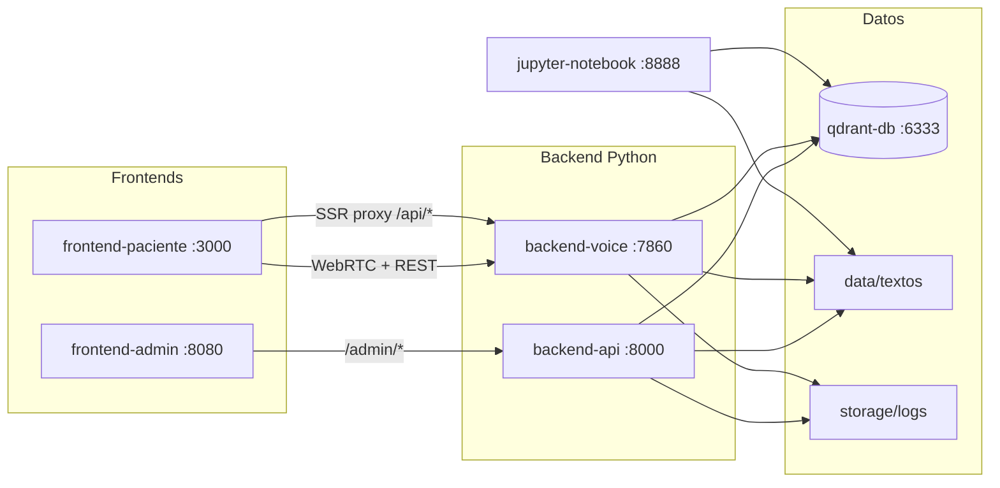

# Guía Docker — postop-voice-agent

Orquestación completa del sistema con un único `docker-compose.yml`.

## Arquitectura



| Servicio | Puerto host | Tecnología | Rol |
| -------- | ----------- | ---------- | --- |
| `qdrant-db` | 6333 | Qdrant v1.19 | Base vectorial (embeddings IBM Granite) |
| `backend-api` | 8000 | FastAPI + uv | API admin, ingest hot-reload, trazas |
| `backend-voice` | 7860 | Pipecat + Groq + Deepgram + Kokoro | WebRTC streaming de voz |
| `frontend-paciente` | 3000 | Next.js 16 | Registro + llamada de voz (María) |
| `frontend-admin` | 8080 | Nginx + HTML/JS | Consola de documentos clínicos |
| `jupyter-notebook` | 8888 | Jupyter Lab | EDA sobre `data/textos` y datos `.xlsx` |

> **Nota:** La consola admin es una SPA estática (`apps/admin-ui/`), no Next.js. Se sirve con Nginx y delega `/admin/*` al backend FastAPI.

## Requisitos previos

- Docker Engine 24+ y Docker Compose v2
- ~8 GB RAM libres y **≥20 GB disco** libres en Docker Desktop
- Archivo `.env` con API keys válidas

## Levantamiento en ≤15 min (compuerta G2)

Un solo comando orquesta build + up + ingesta + verificación:

```bash
cp .env.example .env   # editar API keys
chmod +x scripts/docker-eval-up.sh
./scripts/docker-eval-up.sh
```

El script **no construye Jupyter** (perfil `analysis`) para ahorrar varios minutos.
Al final imprime el tiempo total en minutos.

### Presupuesto de tiempo orientativo

| Fase | Qué hace | Tiempo típico (1.ª vez) |
| ---- | -------- | ---------------------- |
| Build | Backend CPU + modelos en imagen + 2 frontends | 6–10 min |
| Up + seed | Qdrant + APIs + protocolos bootstrap + UIs healthy | 1–2 min |
| Bootstrap Qdrant | Restaura snapshot si existe; si no, ingesta PDFs sin Gemini | 0–6 min |
| **Total** | Con snapshot en `bootstrap/qdrant/` | **~4–10 min** |
| **Total** | Sin snapshot (1.ª vez, fallback ingest) | **~10–18 min** |

Rebuilds posteriores suelen bajar a **3–5 min** gracias a caché de Docker BuildKit.

### Optimizaciones aplicadas

- PyTorch **CPU-only** (sin paquetes NVIDIA CUDA)
- Caché BuildKit para `uv` y Hugging Face durante el build
- **Una sola imagen** `postop-backend:local` compartida por API, voz e ingest
- Jupyter fuera del camino crítico (`--profile analysis`)
- Protocolos precargados en `bootstrap/protocols/` → runtime en `storage/protocols/` (sin Gemini al arrancar)
- Snapshot Qdrant opcional en `bootstrap/qdrant/` (restaura en segundos si existe)
- Ingesta fallback: `--skip-protocols` (solo embeddings de PDFs)
- Ingesta Docker: `PROTOCOL_GENERATION_DELAY_SECONDS=0`, `OCR_ENABLED=false`, `EMBEDDING_BATCH_SIZE=64`
- Healthchecks más cortos; voz ya no espera a que admin esté healthy

## 1. Configurar entorno (manual)

```bash
cp .env.example .env
```

Edita `.env` y define al menos:

```env
GROQ_API_KEY=...
GEMINI_API_KEY=...
DEEPGRAM_API_KEY=...
ADMIN_TOKEN=un_token_seguro

QDRANT_HOST=qdrant-db
TEXTOS_DIR=data/textos
NEXT_PUBLIC_VOICE_API_URL=http://localhost:7860
VOICE_WEB_CORS_ORIGINS=http://localhost:3000,http://127.0.0.1:3000
```

## 2. Construir e iniciar (manual)

```bash
export DOCKER_BUILDKIT=1
docker compose build backend-api frontend-paciente frontend-admin
docker compose up -d
```

La primera build descarga Kokoro, IBM Granite y dependencias PyTorch CPU (~6–10 min según red).

Verifica salud:

```bash
docker compose ps
curl -sf http://localhost:6333/readyz && echo " Qdrant OK"
curl -sf http://localhost:8000/openapi.json > /dev/null && echo " Admin API OK"
curl -sf http://localhost:7860/status && echo " Voice Web OK"
curl -sf http://localhost:3000 > /dev/null && echo " Frontend paciente OK"
curl -sf http://localhost:8080 > /dev/null && echo " Frontend admin OK"
```

## 3. Bootstrap e ingesta

**Arranque eval (`./scripts/docker-eval-up.sh`):**

1. Copia protocolos `bootstrap/protocols/` → `storage/protocols/` si está vacío.
2. Restaura snapshot Qdrant desde `bootstrap/qdrant/` si existe.
3. Si aún no hay readiness, ingesta PDFs con `--skip-protocols` (protocolos ya cargados).

**Regenerar artefactos bootstrap** (mantenedores, tras cambiar corpus o embeddings):

```bash
chmod +x scripts/build-bootstrap.sh
./scripts/build-bootstrap.sh
```

**Ingesta manual completa** (desarrollo; incluye protocolos Gemini):

```bash
docker compose --profile init run --rm ingest-init
```

Alternativa:

```bash
docker compose exec backend-api postop-ingest --recreate
```

## 4. Probar el sistema de punta a punta

1. **Consola admin** → http://localhost:8080
   - Pega el `ADMIN_TOKEN` configurado en `.env`
   - Sube un PDF; debe indexarse en Qdrant vía `backend-api`

2. **App paciente** → http://localhost:3000
   - Completa el formulario de registro
   - **Antes de `ingest-init`**, el botón de llamada permanece deshabilitado
   - Tras la ingesta, inicia la llamada de voz (micrófono del navegador)
   - WebRTC negocia contra `http://localhost:7860` (Pipecat Small WebRTC)

3. **Jupyter EDA (opcional)** → levantar con `docker compose --profile analysis up -d jupyter-notebook` → http://localhost:8888

4. **Trazas de llamadas** → `./storage/logs/calls/<call_id>/`
5. **Protocolos clínicos** → `./storage/protocols/<procedimiento>/protocol.json`

## Volúmenes persistentes

| Volumen / bind mount | Contenido |
| -------------------- | --------- |
| `qdrant_data` | Índice vectorial Qdrant |
| `hf_cache` | Caché Hugging Face (Granite + Kokoro) |
| `./data/textos` | PDFs clínicos compartidos (admin sube, backend ingesta) |
| `./bootstrap/protocols` | Protocolos clínicos versionados (seed al arranque) |
| `./bootstrap/qdrant` | Snapshot Qdrant opcional (restaura índice pre-calculado) |
| `./storage/protocols` | Protocolos en runtime (hot reload admin) |
| `./storage/logs` | Eventos y resúmenes de llamadas |
| `./notebooks` | Notebooks Jupyter |
| `./data` | Datasets `.xlsx` para análisis |

## WebSockets / WebRTC (Pipecat)

- El navegador **no** puede usar hostnames Docker internos (`backend-voice`).
- `NEXT_PUBLIC_VOICE_API_URL` debe apuntar al host donde el usuario abre el frontend (`http://localhost:7860` en local).
- `VOICE_API_URL=http://backend-voice:7860` (solo server-side en Next.js) proxya `/api/procedures`.
- CORS del servidor de voz se controla con `VOICE_WEB_CORS_ORIGINS`.
- Puertos UDP adicionales no son necesarios con Small WebRTC (ICE/STUN vía Google).

## Comandos útiles

```bash
# Logs en vivo
docker compose logs -f backend-voice frontend-paciente

# Regenerar protocolos clínicos
docker compose exec backend-api postop-protocols

# Parar y conservar datos
docker compose down

# Parar y borrar índice Qdrant (re-ingesta necesaria)
docker compose down -v
```

## Solución de problemas

| Síntoma | Causa probable | Acción |
| ------- | -------------- | ------ |
| Voice UI no conecta | `NEXT_PUBLIC_VOICE_API_URL` incorrecta | Debe ser `http://localhost:7860`, reconstruir frontend |
| Build falla con `nvidia-cuda-runtime` | PyTorch CUDA en contenedor CPU | Ya forzado `torch` CPU en `pyproject.toml`; ejecutar `docker builder prune -f` y rebuild |
| `input/output error` en BuildKit | Disco lleno o Docker Desktop corrupto | Liberar espacio, `docker system prune -a`, reiniciar Docker Desktop |
| Admin 502 al subir PDF | Cuota Gemini o Qdrant caído | Revisar logs: `docker compose logs backend-api` |
| Ingesta vacía | `data/textos` sin PDFs | Verificar bind mount y ejecutar `ingest-init` |
| OCR no funciona | Tesseract ausente | Ya incluido en imagen backend (`tesseract-ocr-spa`) |
| Protocolos vacíos tras `up` | Seed falló | Verificar `bootstrap/protocols/` y `storage/protocols/` |
| Qdrant vacío sin snapshot | Esperado sin `bootstrap/qdrant/*.snapshot` | Ejecutar `./scripts/build-bootstrap.sh` o dejar que eval-up haga ingest fallback |
