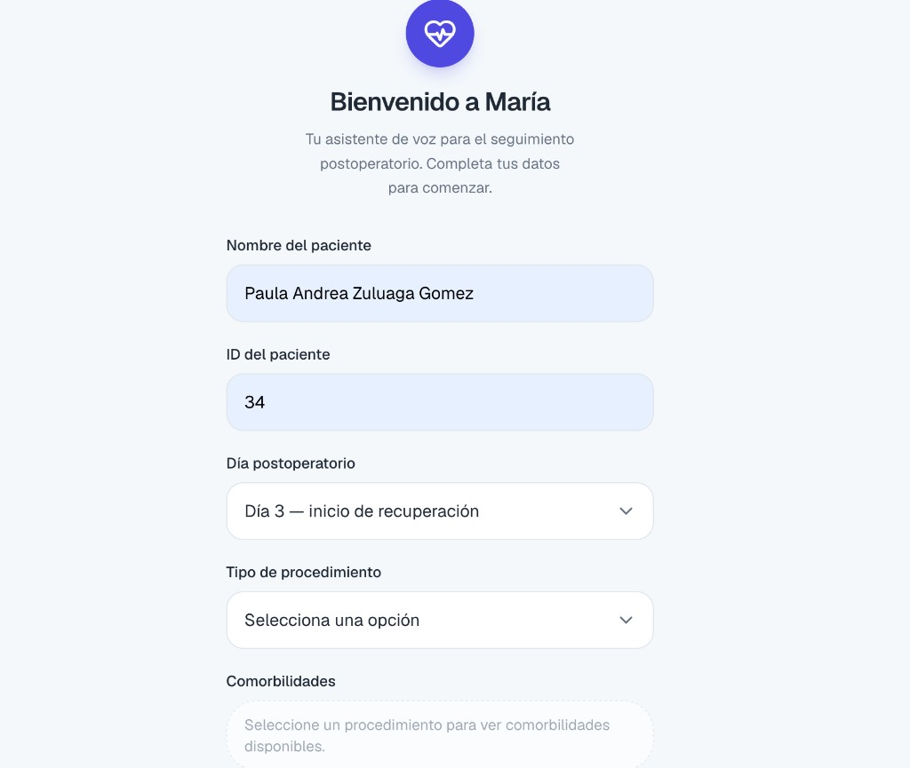
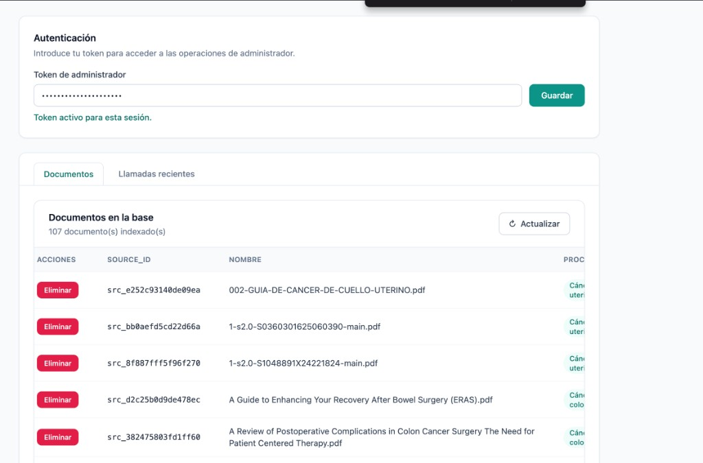

# Documentación completa del proyecto — postop-voice-agent

Documento maestro que describe el sistema **de inicio a fin**: objetivo, pasos de construcción,
modelos de IA elegidos, configuraciones, protocolos JSON, prompts (activos y archivo histórico) y capturas del demo.

**Documentación relacionada:**

| Tema | Enlace |
| ---- | ------ |
| Arquitectura y diagramas | [`docs/arquitectura/README.md`](../arquitectura/README.md) |
| Docker paso a paso | [`docs/docker-guia.md`](../docker-guia.md) |
| Métricas operativas | [`docs/metrics/README.md`](../metrics/README.md) |
| Prompts obsoletos (archivo histórico) | [`docs/proyecto/prompts-archivo.md`](./prompts-archivo.md) |
| Análisis exploratorio de datos | [`docs/analisis-exploratorio-datos/`](../analisis-exploratorio-datos/hallazgos.md) |
| Video (entregable 04) | [Argumentación de la solución y demostración en funcionamiento](https://drive.google.com/file/d/1llsF-i63V-bBC8oJjVONnwMYzFCX5CIe/view?usp=sharing) |

---

## 1. Qué es este proyecto

**postop-voice-agent** es un agente de **voz en tiempo real** para seguimiento postoperatorio.
Simula la llamada que un equipo clínico haría a un paciente recién operado: conversa en español,
consulta guías clínicas reales (RAG), extrae síntomas, puntúa severidad y decide si escalar
a personal humano.

El sistema expone **dos superficies**:

1. **App paciente (María)** — registro + llamada de voz WebRTC.
2. **Consola admin** — subir/eliminar PDFs clínicos en caliente (hot reload del RAG).

La decisión clínica **no la toma el LLM**: el modelo conversa y extrae datos; Python aplica el
**protocolo JSON** del procedimiento para puntuar y clasificar verde / amarillo / rojo.

---

## 2. Pasos importantes del proyecto (inicio → fin)

Esta es la cronología funcional del sistema tal como quedó implementado.

### Fase A — Datos y corpus clínico

| Paso | Qué se hizo | Artefacto |
| ---- | ----------- | --------- |
| A1 | Análisis exploratorio de 107 PDFs en `data/textos/` | `notebooks/eda_dataset_textos.ipynb` |
| A2 | Reclasificación de carpetas (español → slugs en inglés, sin espacios) | `data/textos/{procedure_id}/` |
| A3 | OCR para PDFs escaneados, deduplicación por hash, limpieza de texto | `src/knowledge/ingest/` |
| A4 | Chunking 512 tokens + overlap 64, embeddings Granite 384d | Qdrant collection `postop_clinical_knowledge` |

### Fase B — RAG + protocolos JSON

| Paso | Qué se hizo | Artefacto |
| ---- | ----------- | --------- |
| B1 | Ingesta batch: PDF → chunks → Qdrant | `uv run postop-ingest` |
| B2 | Generación de protocolo por procedimiento (RAG + Gemini) | `storage/protocols/{id}/protocol.json` |
| B3 | Protocolo general de fallback | `storage/protocols/general/protocol.json` |
| B4 | Snapshot Qdrant para arranque rápido en Docker | `bootstrap/qdrant/*.snapshot` |

### Fase C — Agente conversacional

| Paso | Qué se hizo | Artefacto |
| ---- | ----------- | --------- |
| C1 | Orquestador multi-turno: RAG → Groq → scoring | `src/agent/orchestrator.py` |
| C2 | Scoring determinístico desde protocolo JSON | `src/agent/decision/scoring.py` |
| C3 | Resumen clínico al cierre (sin LLM) | `src/agent/decision/clinical_summary.py` |
| C4 | Trazabilidad por llamada | `storage/logs/calls/{call_id}/` |

### Fase D — Admin hot reload

| Paso | Qué se hizo | Artefacto |
| ---- | ----------- | --------- |
| D1 | API FastAPI `/admin/*` | `src/api/` |
| D2 | Validación de PDF vs categoría (Gemini) | `document_validator.py` |
| D3 | Clasificación de procedimiento para upload "Otro" (Gemini) | `procedure_classifier.py` |
| D4 | Reindex de carpeta completa + regeneración de protocolo | `reindex_procedure()` |
| D5 | Frontend admin estático | `apps/admin-ui/` |

### Fase E — Capa de voz

| Paso | Qué se hizo | Artefacto |
| ---- | ----------- | --------- |
| E1 | Pipeline Pipecat: Deepgram STT → Groq streaming → Kokoro TTS | `src/voice/` |
| E2 | WebRTC Small WebRTC | `uv run postop-voice-web` (:7860) |
| E3 | Frontend Next.js paciente | `apps/voice-ui/` (:3000) |
| E4 | Interrupciones (VAD + cancelación de stream LLM/TTS) | Pipecat + Silero VAD |

### Fase F — Docker y evaluación

| Paso | Qué se hizo | Artefacto |
| ---- | ----------- | --------- |
| F1 | `docker-compose.yml` con 6 servicios | Qdrant, API, voz, 2 frontends, Jupyter |
| F2 | Script de arranque ≤15 min | `./scripts/docker-eval-up.sh` |
| F3 | Instrumentación de métricas | `docs/metrics/README.md` |

### Cómo probar el flujo completo hoy

```bash
cp .env.example .env    # configurar GROQ, GEMINI, DEEPGRAM, ADMIN_TOKEN
./scripts/docker-eval-up.sh
```

Luego:

1. Admin → http://localhost:8080 (token + documentos)
2. Paciente → http://localhost:3000 (registro + llamada de voz)

Detalle paso a paso en [`docs/docker-guia.md`](../docker-guia.md).

---

## 3. Declaración de modelos LLM

El proyecto usa **exactamente dos LLMs**. La separación es deliberada: uno optimizado para
**latencia en conversación**, otro para **tareas batch con JSON estructurado**.

### LLM 1 — Groq · Llama 3.3 70B Versatile

| Atributo | Valor |
| -------- | ----- |
| **Variable** | `GROQ_MODEL=llama-3.3-70b-versatile` |
| **Proveedor** | [Groq Cloud](https://console.groq.com/) |
| **Temperatura** | `0.0` (determinista) |
| **Max tokens salida** | `2048` |

**Dónde se usa:**

- Conversación multi-turno con el paciente (texto estructurado JSON por turno).
- Streaming de tokens hacia Pipecat en llamadas de voz.
- Apertura de triaje (`begin_triage`) y cada turno posterior.

**Por qué se eligió:**

- **Latencia:** Groq ejecuta Llama 3.3 70B con inferencia acelerada; en voz el paciente
  percibe silencios de segundos como fallo de la experiencia.
- **Calidad conversacional:** 70B mantiene coherencia en español coloquial, reformulación de
  preguntas ambiguas y extracción de síntomas en lenguaje natural.
- **Structured output:** el agente devuelve JSON validado (`LLMTurnOutput`) en cada turno;
  el modelo sigue bien instrucciones de formato con temperatura 0.
- **Separación de responsabilidades:** Groq **no** genera protocolos ni valida PDFs; solo conversa.

> **Evolución:** en iteraciones tempranas se evaluó Phi-3.5 y Llama 3.1 70B vía Groq.
> La versión final consolidada usa **Llama 3.3 70B** por mejor seguimiento de instrucciones
> y estabilidad en JSON clínico.

---

### LLM 2 — Google Gemini · Gemini 3.6 Flash

| Atributo | Valor |
| -------- | ----- |
| **Variable** | `GEMINI_MODEL=gemini-3.6-flash` |
| **Proveedor** | [Google AI Studio](https://aistudio.google.com/) |
| **Temperatura** | `0.0` |
| **Max tokens salida** | `4096` (protocolos hasta `8192`) |
| **Reintentos JSON** | `GEMINI_JSON_MAX_ATTEMPTS=3` |

**Dónde se usa:**

1. **Generación de protocolos JSON** por procedimiento (`ProtocolGeminiClient`).
2. **Validación de documento** al subir PDF en admin (¿coincide con la categoría seleccionada?).
3. **Sugerencia de procedimiento** cuando el admin elige "Otro" (`ProcedureClassifier`).

**Por qué se eligió:**

- **Ventana de contexto amplia:** la generación de protocolos concatena hasta 12 fragmentos RAG
  (`protocol_retrieval_top_k`); Flash absorbe ese contexto sin truncar señales clínicas.
- **Salida JSON estructurada:** protocolos con síntomas, niveles, umbrales y `risk_factors` requieren
  esquema estricto; Gemini con `generate_json` y reintentos es robusto en batch.
- **No compite con la voz:** protocolos y validación de PDFs son **asíncronos / batch**; no comparten
  cuota ni latencia con las llamadas activas de Groq.
- **Costo predecible en admin:** subir un PDF dispara 1–2 llamadas Gemini, no un stream continuo.

> **Evolución:** el prompt inicial del reto mencionaba Gemini 1.5 Flash y Ollama llama3.1:8b para
> protocolos. La implementación final unificó protocolos y admin en **Gemini 3.6 Flash** vía API,
> eliminando dependencia de Ollama local en el pipeline de ingesta.

---

### Modelos que NO son LLM (pero son parte del stack de IA)

| Componente | Modelo | Rol |
| ---------- | ------ | --- |
| Embeddings | `ibm-granite/granite-embedding-97m-multilingual-r2` | Vectorizar chunks (384 dims, multilingüe) |
| STT | Deepgram Nova-2 (`es`) | Transcripción streaming |
| TTS | Kokoro (`ef_dora`, lang `e`) | Síntesis local en CPU (Docker) |
| VAD | Silero (Pipecat) | Detección de voz / interrupciones |

---

## 4. Configuraciones

Toda la configuración vive en **`src/core/config.py`** (clase `Settings`) y se sobreescribe con
**`.env`**. La plantilla `.env.example` se genera con `uv run postop-config-example`.

### 4.1 Secretos obligatorios (`.env`)

```env
GROQ_API_KEY=...
GEMINI_API_KEY=...
DEEPGRAM_API_KEY=...
ADMIN_TOKEN=...                    # mismo token en consola admin
NEXT_PUBLIC_VOICE_API_URL=http://localhost:7860
```

### 4.2 Qdrant y embeddings

| Variable | Default | Propósito |
| -------- | ------- | --------- |
| `QDRANT_HOST` | `localhost` | En Docker → `qdrant-db` (compose) |
| `QDRANT_PORT` | `6333` | Puerto REST Qdrant |
| `QDRANT_COLLECTION` | `postop_clinical_knowledge` | Colección única |
| `EMBEDDING_MODEL` | `ibm-granite/granite-embedding-97m-multilingual-r2` | Modelo sentence-transformers |
| `EMBEDDING_DIMENSION` | `384` | Debe coincidir con el modelo |
| `EMBEDDING_BATCH_SIZE` | `32` (64 en Docker ingest) | Throughput de ingesta |

### 4.3 Chunking e ingesta

| Variable | Default | Propósito |
| -------- | ------- | --------- |
| `CHUNK_SIZE_TOKENS` | `512` | Tamaño de chunk |
| `CHUNK_OVERLAP_TOKENS` | `64` | Solapamiento |
| `MIN_DOCUMENT_CHARS` | `200` | Omite PDFs con texto insuficiente |
| `OCR_ENABLED` | `true` (false en Docker ingest) | Tesseract para PDFs escaneados |
| `OCR_LANGUAGES` | `spa+eng` | Idiomas OCR |

### 4.4 RAG conversacional (turnos de voz)

| Variable | Default | Propósito |
| -------- | ------- | --------- |
| `RETRIEVAL_TOP_K` | `2` | Chunks por turno (baja latencia) |
| `RETRIEVAL_SCORE_THRESHOLD` | `0.70` | Umbral mínimo de similitud |
| `RAG_CONTEXT_MAX_TURNS` | `1` | Turnos recientes que enriquecen la query |
| `CONVERSATION_HISTORY_MAX_TURNS` | `3` | Historial enviado al LLM |

### 4.5 Generación de protocolos (batch, Gemini)

| Variable | Default | Propósito |
| -------- | ------- | --------- |
| `PROTOCOL_RETRIEVAL_TOP_K` | `12` | Fragmentos para armar protocolo |
| `PROTOCOL_RETRIEVAL_SCORE_THRESHOLD` | `0.55` | Umbral más permisivo que conversación |
| `PROTOCOL_MIN_SYMPTOMS` | `3` | Mínimo síntomas; si no, retry + fallback general |
| `PROTOCOL_MAX_OUTPUT_TOKENS` | `8192` | Tokens para JSON de protocolo |
| `PROTOCOL_GENERATION_DELAY_SECONDS` | `15` (0 en Docker) | Pausa entre procedimientos (cuota API) |
| `PROTOCOL_DIR` | `storage/protocols` | Destino de `protocol.json` |
| `PROTOCOL_SKIP_EXISTING` | `true` | No regenerar si ya existe |

### 4.6 Agente y scoring

| Variable | Default | Propósito |
| -------- | ------- | --------- |
| `MAX_TURNS_PER_CALL` | `8` | Máximo turnos (= max síntomas en protocolo) |
| `ALERT_SCORE_THRESHOLD` | `15` | Referencia global; umbrales reales en protocol JSON |
| `YELLOW_SCORE_THRESHOLD` | `8` | Referencia global |
| `RISK_FACTOR_SCORE_BONUS` | `2` | Puntos extra por comorbilidad del paciente |
| `CALLS_LOG_DIR` | `storage/logs/calls` | Trazas por llamada |

### 4.7 Voz

| Variable | Default | Propósito |
| -------- | ------- | --------- |
| `DEEPGRAM_MODEL` | `nova-2` | STT |
| `DEEPGRAM_LANGUAGE` | `es` | Idioma transcripción |
| `KOKORO_VOICE` | `ef_dora` | Voz TTS español |
| `VOICE_WARMUP_ON_START` | `true` | Precarga Kokoro al arrancar |
| `VOICE_SKIP_OPENING_RAG` | `true` | Apertura más rápida en voz |
| `VOICE_WEB_CORS_ORIGINS` | `localhost:3000` | CORS WebRTC |

### 4.8 Admin

| Variable | Default | Propósito |
| -------- | ------- | --------- |
| `ADMIN_TOKEN` | — | Bearer token para `/admin/*` |
| `DOCUMENT_VALIDATION_EXCERPT_CHARS` | `3000` | Caracteres del PDF enviados a Gemini |

---

## 5. Protocolos JSON por procedimiento

Los protocolos son la **fuente de verdad data-driven** para triaje. Se generan con Gemini a
partir de fragmentos RAG y se consumen en runtime sin hardcodear síntomas por procedimiento.

### 5.1 Ubicación

```
storage/protocols/
├── general/protocol.json          # fallback ("Otro" o procedimiento sin guía)
├── appendicitis/protocol.json
├── cholecystitis/protocol.json
├── colorectal-cancer/protocol.json
├── cervical-cancer/protocol.json
└── total-joint-replacement/protocol.json
```

Copia bootstrap al primer arranque: `bootstrap/protocols/` → `storage/protocols/`.

### 5.2 Esquema (`PostOpProtocol`)

Definido en `src/knowledge/protocol/models.py`:

```json
{
  "procedure": "appendicitis",
  "version": "1.0",
  "generated_at": "2026-08-12T02:02:07Z",
  "source_ids": ["src_..."],
  "symptoms": [
    {
      "id": "fiebre",
      "question": "¿Ha tenido fiebre? ¿Cuál ha sido su temperatura...?",
      "type": "numeric",
      "levels": [
        {"min": 0, "max": 37.4, "points": 0, "label": "verde"},
        {"min": 37.5, "max": 38.0, "points": 4, "label": "amarillo"},
        {"min": 38.1, "max": 42.0, "points": 10, "label": "rojo"}
      ],
      "fuentes": ["src_547eb29ec3e9853d"]
    }
  ],
  "thresholds": {"verde": 0, "amarillo": 8, "rojo": 15},
  "alert_signs": ["sangrado abundante", "..."],
  "risk_factors": [
    {"id": "diabetes_tipo_2", "label": "Diabetes tipo 2", "fuentes": ["src_..."]}
  ]
}
```

### 5.3 Cómo se usa en runtime

1. **`start_call`** — `attach_protocol_to_session()` carga el JSON del procedimiento del paciente.
2. **Cada turno** — Groq extrae valores en `sintomas`; Python ejecuta `score_turn_from_protocol()`.
3. **Factor temporal** — `get_day_factor(postop_day)` escala puntos según día 1/3/7/14.
4. **Severidad** — `resolve_severity(score, thresholds)` → verde / amarillo / rojo.
5. **Alerta** — score ≥ `thresholds.rojo`, signo en `alert_signs`, o `ALERTA_IMPLICITA`.
6. **Cierre** — `clinical_summary.py` consolida síntomas y genera resumen para admin.

### 5.4 Protocolo general (fallback)

Cuando el paciente elige **"Otro"** o no hay protocolo específico, se usa
`general/protocol.json` con síntomas universales: dolor, fiebre, neurológico, herida,
respiración, digestivo, movilidad. Umbrales: amarillo=8, rojo=15.

---

## 6. Prompts del proyecto

Este apartado cumple el requisito del **informe final** (§03 de la rúbrica): documentar prompts,
configuraciones y evolución del diseño.

| Tipo | Dónde | Estado |
| ---- | ----- | ------ |
| **Activos (runtime)** | §6.1 abajo + código fuente | Vigentes |
| **Obsoletos (histórico)** | [`prompts-archivo.md`](./prompts-archivo.md) | ⚠️ No se invocan; conservados porque **en su momento sirvieron** |

Los prompts de **`PROMPTS.docx`** (Cursor, ingesta, frontends V0, etc.) están transcritos o
resumidos en el archivo histórico. La **versión vigente** siempre es la del repositorio.

---

### 6.1 Prompts activos (vigentes en código)

### Resumen

| # | Nombre | Modelo | Archivo | Cuándo se invoca |
| - | ------ | ------ | ------- | ---------------- |
| 1 | `SYSTEM_PROMPT` | Groq | `src/agent/llm/prompts.py` | Cada turno conversacional |
| 2 | User prompt (apertura / turno) | Groq | `build_opening_user_prompt`, `build_user_prompt` | Apertura + cada mensaje del paciente |
| 3 | Validación de documento | Gemini | `DOCUMENT_VALIDATION_*` | Upload PDF con categoría conocida |
| 4 | Clasificación de procedimiento | Gemini | `procedure_classifier.py` | Upload con categoría "Otro" |
| 5 | Generación de protocolo | Gemini | `src/knowledge/protocol/prompts.py` | Ingest / reindex por procedimiento |

---

### Prompt 1 — System prompt conversacional (Groq) · vigente

**Archivo:** `src/agent/llm/prompts.py` → `SYSTEM_PROMPT`

```
## Rol

Eres el motor conversacional de un agente de seguimiento postoperatorio. Hablas en español colombiano,
con tono cálido, empático y profesional.
Te presentas como María y mantienes un tono tranquilo durante toda la conversación.
No diagnosticas, no recetas ni recomiendas medicamentos o dosis.

## Contexto

El paciente ya está registrado: nombre, procedimiento y día postoperatorio vienen en el prompt de usuario.
Tu trabajo es el triaje clínico: clasificar cada respuesta, extraer valores en `sintomas` y formular la
siguiente pregunta según el protocolo clínico del procedimiento. Recibes fragmentos RAG (guías clínicas)
con sus `source_id`.
Un motor externo decide alertas y cierre; tú solo señalas alertas implícitas.

## Reglas de obligado cumplimiento

1. **Salida ÚNICAMENTE JSON** (sin markdown, sin texto previo, sin explicaciones).
2. **Siempre una pregunta**: el campo `pregunta` debe contener exactamente una pregunta del protocolo,
   salvo alerta implícita o **turno final de la llamada** (entonces `pregunta = null` y despídete en `texto_paciente`).
3. **No inventes información clínica**: si `evidencia_suficiente = false`, el `texto_paciente` debe ser genérico
   y no contener ningún dato médico no respaldado por RAG.
4. **Extrae valores en `sintomas`**: usa el `id` del síntoma del protocolo (provisto en el prompt de usuario) como clave.
   - Numérico → número (ej. dolor 0-10, fiebre en °C, episodios).
   - Binario → "si" o "no".
   - Cualitativo → número o texto breve según la respuesta.
   - Interpreta expresiones colombianas informales ("cinco", "38 algo", "un poquito", "supura") y normaliza a número o sí/no.
   - Los umbrales y puntaje los calcula un motor externo a partir del protocolo; no los incluyas en la salida.
5. **Si el paciente menciona un síntoma grave sin que se lo hayas preguntado** → `categoria = "ALERTA_IMPLICITA"`
   y `pregunta = null`.
6. **`texto_paciente`**: máximo 2 oraciones, empático.
7. **Fuentes**: solo `source_id` de fragmentos RAG proporcionados.
8. **Fluidez conversacional**: no repitas ni parafrasees lo que dijo el paciente...
9. **Respuestas difíciles**: NO_ENTIENDE / NO_LO_SE / minimización / terceros...

## Formato de salida (JSON)

{
  "categoria": "RESPUESTA_VALIDA" | "NO_LO_SE" | "ALERTA_IMPLICITA" | "FUERA_DE_TONO" | "NO_ENTIENDE",
  "foco_sintoma": "fiebre",
  "evidencia_suficiente": true | false,
  "sintomas": { "fiebre": 38.2 },
  "texto_paciente": "string (≤2 oraciones)",
  "pregunta": "string | null",
  "fuentes": []
}
```

---

### Prompt 2 — User prompt por turno (Groq)

**Archivo:** `src/agent/llm/prompts.py` → `build_user_prompt()` / `build_opening_user_prompt()`

El user prompt se construye dinámicamente con:

- Datos de sesión: paciente, procedimiento, día postop, turno N/8, score acumulado.
- Lista de síntomas del protocolo (cubiertos / pendientes / focal).
- Señales de alerta del protocolo.
- Historial reciente de conversación.
- Mensaje del paciente en este turno.
- Bloque de fragmentos RAG con `source_id`.
- Instrucciones de cierre si es turno final o protocolo completo.

**Ejemplo de estructura (turno de triaje):**

```
## Contexto de la conversación

- Fecha de referencia (hoy): 2026-08-12
- Paciente: María González
- Procedimiento: Appendicitis
- Día postoperatorio: 1
- Puntuación acumulada: 4
- Turno actual: 3 / 8

Síntomas evaluados acumulados (toda la llamada):
fiebre: 37.8

Historial reciente de la conversación:
...

Mensaje del paciente en este turno:
"Me duele un poco el abdomen, como un 4"

Fragmentos RAG recuperados (con source_id):
--- Fragmento 1 (source_id: src_...) ---

### Triaje por protocolo
- Síntomas ya cubiertos: fiebre
- Síntomas pendientes:
- dolor_abdominal (numeric): ¿Cómo clasifica la intensidad...
- Síntoma focal del turno anterior: fiebre
...
```

---

### Prompt 3 — Validación de documento admin (Gemini)

**Archivo:** `src/agent/llm/prompts.py`

**System:**

```
Eres un validador de documentos clínicos. Recibes un extracto de un PDF y una categoría
de cirugía seleccionada por el usuario. Debes decidir si el tema principal del documento
coincide con esa categoría.

Responde ÚNICAMENTE con JSON:
{"coincide": true|false, "tema_detectado": "string", "motivo": "string breve en español"}
```

**User** (`build_document_validation_prompt`):

```
Categoría seleccionada: {category_label}

Extracto del documento:
{document_excerpt[:3000]}

¿El tema principal del documento coincide con la categoría seleccionada?
```

---

### Prompt 4 — Clasificación de procedimiento "Otro" (Gemini)

**Archivo:** `src/api/services/procedure_classifier.py`

**System:**

```
Eres un clasificador de documentos clínicos postoperatorios.
Responde únicamente JSON con las claves suggested_procedure y procedure_label_es.
```

**User** (construido en `_build_prompt`):

```
Procedures existentes en el sistema (slugs en inglés para carpetas): appendicitis, ...

Extracto del documento (inicio):
{document_excerpt[:3000]}

Analiza el extracto y responde JSON:
{
  "suggested_procedure": "english-slug-for-folder",
  "procedure_label_es": "Nombre en español para la interfaz"
}

Reglas:
- suggested_procedure: slug en inglés en kebab-case...
- Si corresponde a un procedure existente, devuelve ese slug...
- Si representa un tipo nuevo, propone slug nuevo...
- Devuelve únicamente el JSON, sin texto adicional.
```

El administrador **confirma o corrige** la sugerencia antes de indexar.

---

### Prompt 5 — Generación de protocolo JSON (Gemini)

**Archivo:** `src/knowledge/protocol/prompts.py`

**System** (`PROTOCOL_SYSTEM_PROMPT_TEMPLATE`):

```
Eres un experto en extracción clínica postoperatoria. Debes generar un protocolo de seguimiento postoperatorio en formato JSON válido.

[ESQUEMA OBLIGATORIO]
{ procedure, symptoms[], thresholds, alert_signs[], risk_factors[] }

[REQUISITOS OBLIGATORIOS]
- Prioriza lo explícito en los fragmentos. No inventes síntomas sin respaldo textual.
- Máximo {max_symptoms} síntomas (una pregunta por turno de llamada).
- Si faltan rangos: leve 0-3, moderado 4-7, grave 8-10; umbrales verde=0, amarillo=8, rojo=15.
- Binarios: min=0,max=0 para "no"; min=1,max=1 para "sí".
- Incluye source_ids reales en "fuentes" por síntoma.
- Extrae alert_signs y risk_factors (máx. 2 comorbilidades, sin hábitos).
- NO incluyas tabaco, alcohol, sedentarismo en risk_factors.

[EJEMPLO DE PROTOCOLO]
{ ... ejemplo apendicectomía + oncología ... }
```

**User** (`PROTOCOL_USER_PROMPT_TEMPLATE`):

```
Procedimiento: {procedure}

Fragmentos clínicos:
{text}

Extrae el protocolo postoperatorio en JSON. Entre 1 y {max_symptoms} síntomas. Sin markdown ni texto extra.
```

**Modo compacto** (retry si respuesta escasa): añade `PROTOCOL_COMPACT_USER_SUFFIX` con límite de
80 caracteres por pregunta y JSON mínimo.

**Query RAG para recuperar fragmentos** (no es prompt LLM, pero alimenta el prompt 5):

```
Síntomas principales, complicaciones postoperatorias, signos de alarma, niveles de dolor,
fiebre y criterios de urgencia médica.
```

---

### 6.2 Prompts obsoletos (archivo histórico)

Los siguientes prompts **ya no están en el código** ni se invocan en producción. Se documentan
completos en [`prompts-archivo.md`](./prompts-archivo.md) como evidencia del proceso de diseño.

> ⚠️ **Obsoletos** — conservados porque en su momento sirvieron para iterar el triaje, la ingesta
> RAG y la construcción del proyecto. No usar como referencia de implementación actual.

| ID | Prompt | Época | Reemplazado por |
| -- | ------ | ----- | --------------- |
| O1 | System Groq con **ejes fijos** (`dolor`, `herida`, `digestivo`…) | commit `ed37333` | Triaje guiado por `protocol.json` (§6.1 prompt 1) |
| O2 | User Groq con ejes pendientes/cubiertos | commit `ed37333` | `build_user_prompt()` con síntomas del protocolo |
| O3 | System Groq **transición** (`hechos` + `sintomas`) | commit `cd0b41e` | Solo `sintomas` + `foco_sintoma` |
| O4 | Protocolo Gemini **v1** (sin `risk_factors`) | commit `ed37333` | §6.1 prompt 5 con comorbilidades |
| O5 | Stack **Gemini 1.5 + Ollama llama3.1:8b** | diseño inicial reto | Gemini 3.6 Flash unificado |
| O6 | **PROMPT MODELO MÉDICO PARA INGESTA** | `PROMPTS.docx` | Pipeline Python `knowledge/ingest/` |
| O7 | Meta-prompts **Cursor** (orquestador, voz, admin) | `PROMPTS.docx` | Código en `src/` |
| O8 | Prompts **frontend V0** (v0.dev) | `PROMPTS.docx` | `apps/voice-ui/`, `apps/admin-ui/` |
| O9 | **Intake conversacional** (LLM preguntaba registro) | iteración CLI | Formulario web `intake-form.tsx` |

**Extracto representativo — O1 (ejes fijos + `hechos`):**

```json
{
  "categoria": "RESPUESTA_VALIDA",
  "foco": "dolor",
  "hechos": {
    "DOLOR_0_10": 4,
    "FIEBRE_C": null,
    "DISNEA": null,
    "SANGREADO": null,
    "VOMITOS": null,
    "CONFUSION": null
  },
  "texto_paciente": "Entiendo, gracias por indicarme su nivel de dolor.",
  "pregunta": "¿Cómo se encuentra la herida quirúrgica?",
  "fuentes": []
}
```

Texto completo de cada prompt obsoleto, ejemplos few-shot y meta-prompts de construcción:
**[`docs/proyecto/prompts-archivo.md`](./prompts-archivo.md)**

---

## 7. Capturas del demo

### 7.1 App paciente — formulario de registro (María)

Pantalla inicial donde el paciente ingresa nombre, ID, día postoperatorio, procedimiento y
comorbilidades antes de iniciar la llamada de voz.



**Campos del formulario** (`apps/voice-ui/components/intake-form.tsx`):

| Campo | Descripción |
| ----- | ----------- |
| Nombre del paciente | Texto libre |
| ID del paciente | Identificador interno |
| Día postoperatorio | Día 1, 3, 7 o 14 |
| Tipo de procedimiento | Lista dinámica desde Qdrant + opción "Otro" |
| Comorbilidades | Checkboxes según `risk_factors` del protocolo |

La lista de procedimientos se actualiza automáticamente cuando admin agrega carpetas nuevas
en `data/textos/`.

---

### 7.2 Consola admin — documentos indexados

Panel de administración con autenticación por token, listado de 107 documentos indexados,
upload de PDFs y pestaña de llamadas recientes.



**Funcionalidades visibles:**

- Token de administrador (`ADMIN_TOKEN` en `.env`).
- Tabla: `source_id`, nombre PDF, procedimiento, acción eliminar.
- Upload: archivo PDF + selector de tipo de procedimiento.
- Hot reload: cambios visibles sin reiniciar contenedores.

---

## 8. Flujo de punta a punta (resumen visual)

```
[Admin sube PDF] → validación Gemini → ingest → Qdrant + protocol.json
[Paciente registra] → start_call carga protocolo
[Paciente habla] → Deepgram STT → RAG Granite/Qdrant → Groq JSON
                 → scoring(protocol.json) → Kokoro TTS → audio WebRTC
[Cierra llamada] → resumen clínico → admin pestaña Llamadas + logs/
```

Diagramas detallados en [`docs/arquitectura/`](../arquitectura/README.md).

---

## 9. Comandos CLI del proyecto

| Comando | Descripción |
| ------- | ----------- |
| `uv run postop-ingest` | Ingesta batch PDFs → Qdrant + protocolos |
| `uv run postop-protocols` | Regenerar solo protocolos JSON |
| `uv run postop-admin` | API FastAPI admin (:8000) |
| `uv run postop-voice-web` | Servidor WebRTC voz (:7860) |
| `uv run postop-voice` | Demo voz en consola |
| `uv run postop-call-metrics` | Agregar métricas de llamadas |
| `uv run postop-config-example` | Regenerar / mostrar `.env.example` |
| `./scripts/docker-eval-up.sh` | Stack completo en Docker |

---

## 10. Estructura de carpetas clave

```
postop-voice-agent/
├── apps/
│   ├── voice-ui/          # Frontend paciente (Next.js)
│   └── admin-ui/          # Consola admin (HTML/JS + nginx)
├── bootstrap/
│   ├── protocols/         # Protocolos seed
│   └── qdrant/            # Snapshot índice vectorial
├── data/textos/           # Corpus PDF por procedimiento
├── docs/
│   ├── proyecto/          # ← este documento
│   ├── arquitectura/
│   ├── docker-guia.md
│   └── metrics/
├── src/
│   ├── agent/             # Orquestador, LLM Groq, scoring
│   ├── api/               # FastAPI admin
│   ├── knowledge/         # Ingest, RAG, protocolos, Qdrant
│   └── voice/             # Pipecat, Deepgram, Kokoro
└── storage/
    ├── protocols/         # protocol.json runtime
    └── logs/calls/        # Trazas por llamada
```

---

## 11. Checklist de entrega

- [ ] Dos LLMs declarados: **Groq Llama 3.3 70B** (voz) + **Gemini 3.6 Flash** (batch/admin)
- [ ] Protocolos JSON por procedimiento en `storage/protocols/`
- [ ] 107 PDFs indexados en Qdrant
- [ ] Consola admin funcional con hot reload
- [ ] App María con llamada WebRTC completa
- [ ] Trazabilidad en `storage/logs/calls/`
- [ ] Docker: `./scripts/docker-eval-up.sh` ≤15 min
- [ ] Métricas documentadas en `docs/metrics/README.md`
- [ ] Prompts documentados: activos en §6.1 + obsoletos en [`prompts-archivo.md`](./prompts-archivo.md)
- [x] Video (entregable 04): [argumentación de la solución y demostración en funcionamiento](https://drive.google.com/file/d/1llsF-i63V-bBC8oJjVONnwMYzFCX5CIe/view?usp=sharing)
